# Tutorial10: 使用mindformers框架完成Qwen2.5大模型的推理

* 集群类型：SCOW AI集群
* 所需镜像：无
* 所需模型：Qwen2.5-7B
* 所需数据集：无
* 所需资源：建议使用1张910B NPU运行本教程。
* 目标：本节旨在使用 Qwen2.5-7B 模型在mindformers框架下完成大模型推理的步骤。

分以下几步来实现：
1. 创建VSCode应用，使用平台提供的mindspore官方镜像
2. 安装mindformers v1.5
3. 模型格式转换：从hugging face框架下的格式转换为mindspore框架下的格式
4. 对 Qwen2.5-7B 大模型进行单卡推理

## 1、拉取镜像并安装

1.1 进入AI集群
登录SCOW平台，选取智算平台，进入AI集群


1.2 创建VSCode交互应用

1.2.1 点击 作业 > ascend-k8s > 应用 > 创建应用


1.2.2 点击VSCode
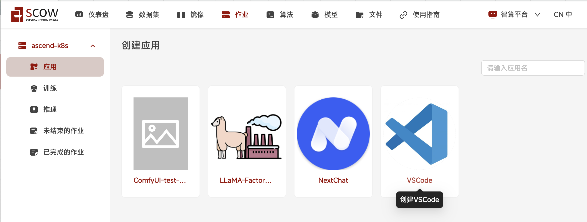

在创建VSCode交互应用页面中，进行配置：

1.2.3 拉取镜像
选择镜像源 - 远程镜像
运行命令 - 勾选 修改默认命令
* 将 app-store-images.pku.edu.cn/ascend/mindspore:openeuler-python3.10-cann8.1.rc1-mindspore2.6.0rc1，粘贴到 远程镜像地址框中，用于平台根据镜像地址拉取相应的mindspore2.6.0rc1镜像
* 将 ${SCOW_AI_ALGORITHM_PATH}/bin/code-server 拷贝后，粘贴到 修改默认命令框中，用于平台启动VSCode应用
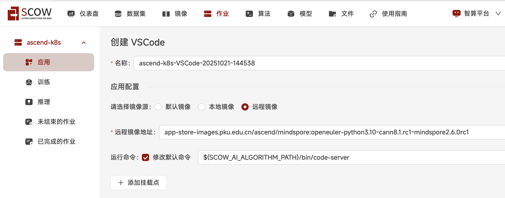

1.2.4 添加模型、算法
* 勾选添加类型 - 算法，下拉菜单中，选取 公共算法；算法下拉菜单中，选取 code-server(official) 算法，版本下拉菜单中，选取 4.95.3，此时应可以看到算法描述部分显示启动命令，与1.2.3步骤中的启动命令是一致的

* 勾选添加类型 - 模型，下拉菜单中，选取 公共模型；模型下拉菜单中，选取 Qwen/Qwen2.5-7B-Instruct(official) 模型，版本下拉菜单中，选取 latest

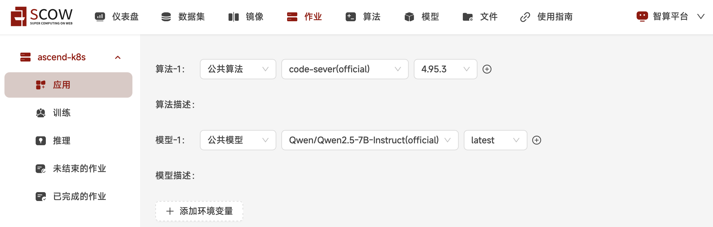

1.2.5 资源部分不需要修改，也可以根据实际需要在 单节点加速卡卡数 中修改为2/4/8（单节点上限是8卡，卡数越多，对大模型训练的时间会相应缩短）然后点击 提交 按钮

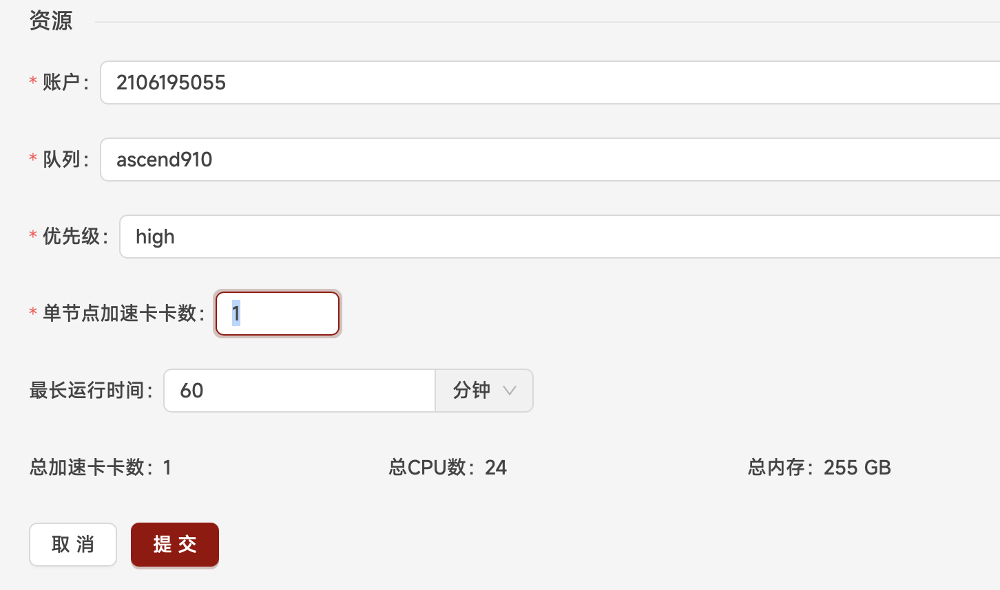

1.2.6 进入新创建的VScode应用的浏览器界面
提交后，刚创建的作业在 未结束的作业 列表中，作业状态为 PENDING。
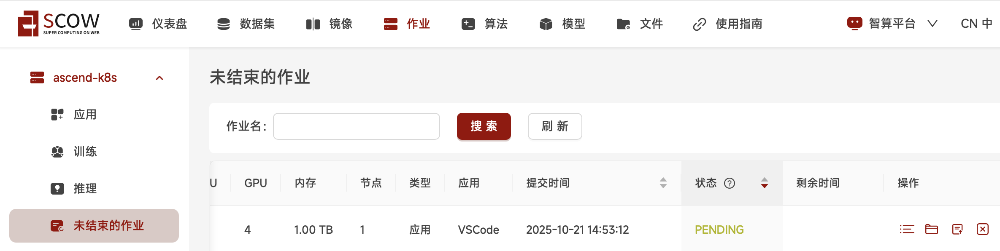

点击 刷新 按钮，手动进行刷新后，作业状态转为 RUNNING。

在这条作业的操作中，点击 进入 图标，浏览器将打开新的页面来展示新创建的VScode应用。
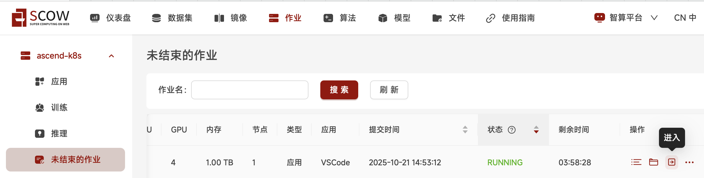

1.2.7 点击打开以自己用户名为名字的文件夹，之后的所有文件都将保存在这个文件夹下，之后的所有操作都将在这个文件夹下进行
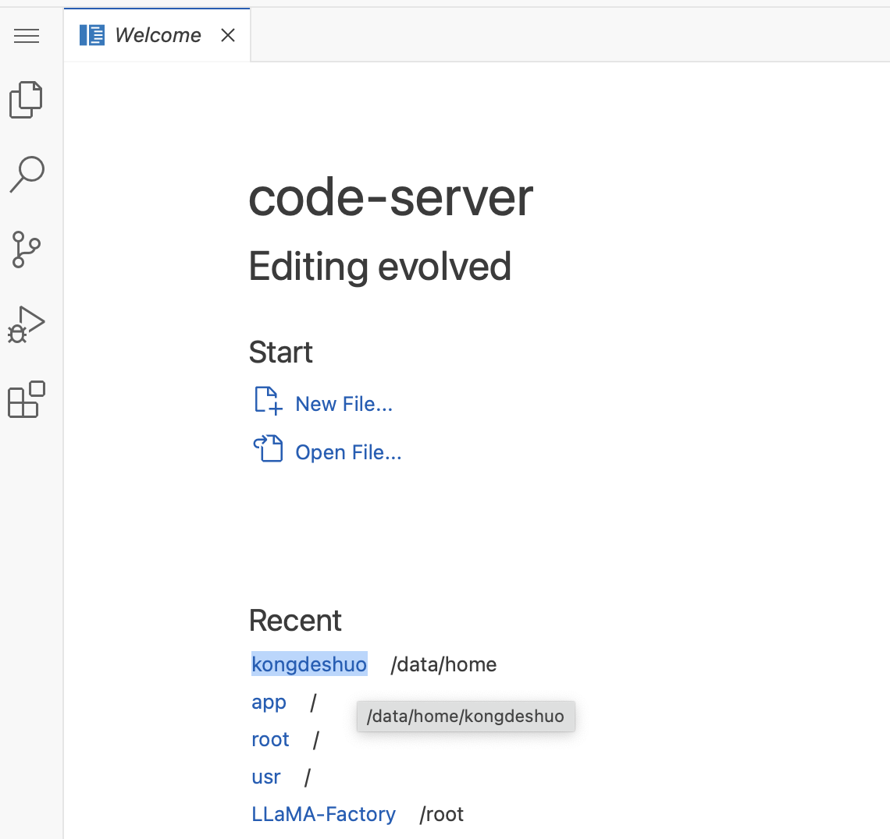

点选左侧导航栏中第一个选项，选择 Termianl > New Terminal 创建新终端


完整的VSCode应用包含的左侧文件夹、右侧上半区域的文件显示窗口、和右侧下半区域的终端
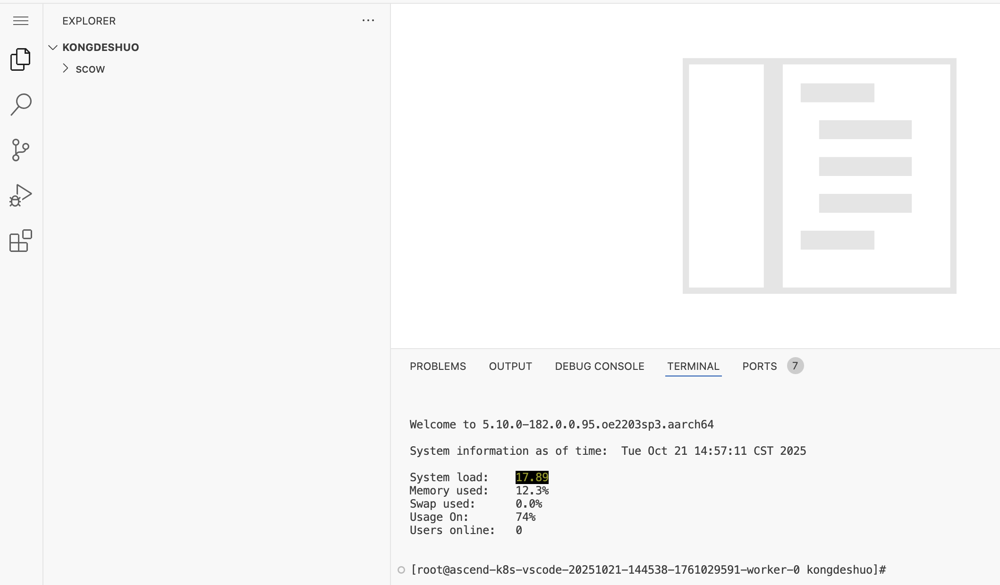

## 2、安装mindformers
2.1 安装工具包

2.1.1 git
拷贝下面命令，在右侧下半部的终端terminal中，粘贴命令 
```bash
yum install -y git
```
再按回车键，确保成功安装
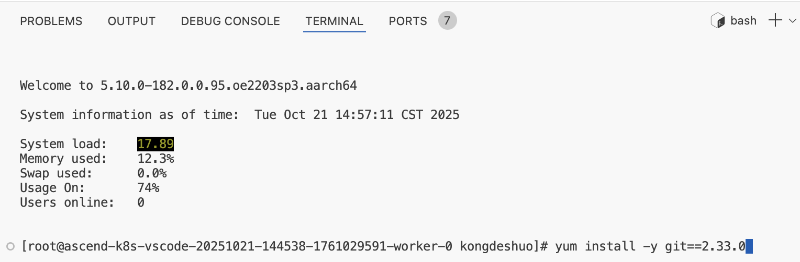

2.1.2 wheel
拷贝下面命令，在右侧下半部的终端terminal中，粘贴命令 
```bash
pip install wheel==0.45.1
```
再按回车键，确保成功安装


2.1.3 hostname
拷贝下面命令，在右侧下半部的终端terminal中，粘贴命令 
```bash
yum install -y hostname
```
再按回车键，确保成功安装
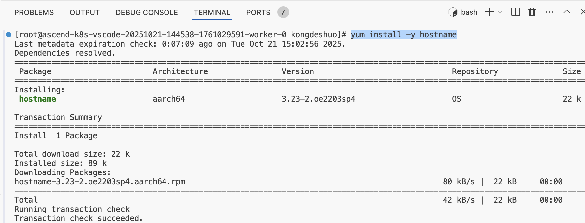

2.1.4 tokenizers和transformers
拷贝下面命令，在右侧下半部的终端terminal中，粘贴命令 
```bash
pip install tokenizers==0.21.0 transformers
```
再按回车键，确保成功安装
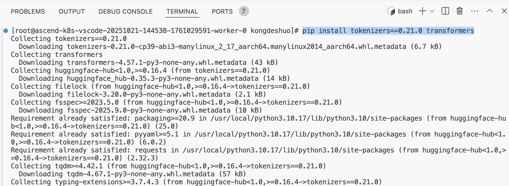
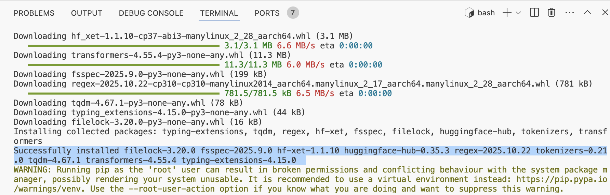

2.1.5 torch-npu
拷贝下面命令，在右侧下半部的终端terminal中，粘贴命令 
```bash
pip3 install torch-npu==2.5.1
```
再按回车键，确保成功安装

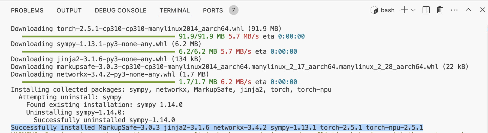

2.2 安装mindformers
2.2.1 拷贝下面命令，在右侧下半部的终端terminal中，粘贴命令 
```bash
pip3 install torch-npu==2.5.1
```
再按回车键，确保成功安装
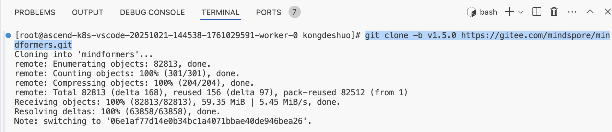
可以看到，在左侧已经有个名字为 mindformers 文件夹已经下载
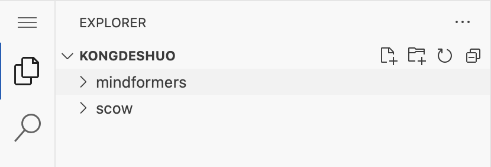

2.2.2 拷贝下面命令，在右侧下半部的终端terminal中，粘贴命令 
```bash
cd mindformers/
```
再按回车键，进入下载好的 mindformers 文件夹


2.2.3 拷贝下面命令，在右侧下半部的终端terminal中，粘贴命令 
```bash
bash build.sh
```
再按回车键，确保成功安装mindformers


2.3.4 验证是否成功安装mindformers
拷贝下面命令，在右侧下半部的终端terminal中，粘贴命令
```bash
python -c "import mindformers as mf;mf.run_check()"
```
再按回车键,出现以下类似结果，证明安装成功
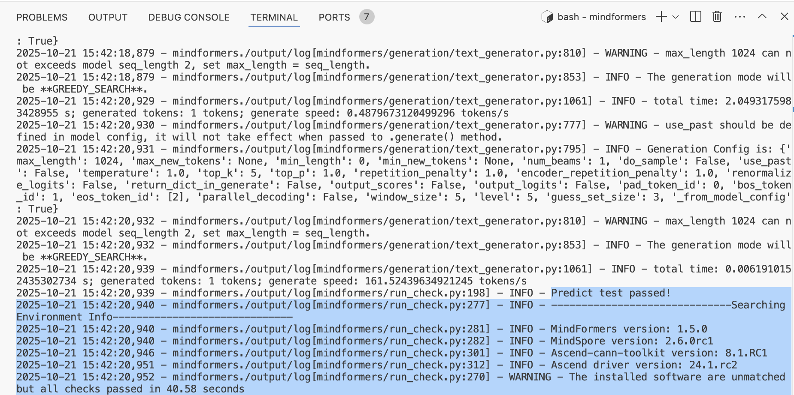

## 3、模型格式转换
3.1 拷贝下面命令，在右侧下半部的终端terminal中，粘贴命令
```bash
python convert_weight.py --model qwen2_5 --input_path $SCOW_AI_MODEL_PATH --output_path ${WORK_DIR}/Qwen2.5-7B-Instruct-Mindspore --dtype bf16
```
再按回车键
### 参数说明
* model:       模型名称
* input_path:  下载HuggingFace权重的文件夹路径
* output_path: 转换后的MindSpore权重文件保存路径
* dtype:       转换权重的精度

## 4、对大模型进行推理
4.1 拷贝下面命令，在右侧下半部的终端terminal中，粘贴命令
```bash
python ./research/qwen2_5/run_qwen2_5.py \
 --config research/qwen2_5/predict_qwen2_5_7b_instruct.yaml \
 --load_checkpoint ${WORK_DIR}/Qwen2.5-7B-Instruct-Mindspore.ckpt \
 --vocab_file $SCOW_AI_MODEL_PATH/vocab.json \
 --merges_file $SCOW_AI_MODEL_PATH/merges.txt \
 --auto_trans_ckpt False \
 --use_parallel False \
 --run_mode predict \
 --predict_data '帮助我制定一份去上海的旅游攻略'
```
再按回车键