# Tutorial4: 大模型推理

* 集群类型：SCOW HPC集群和SCOW AI集群
* 所需镜像：无
* 所需模型：Qwen3-4B
* 所需数据集：无
* 所需资源：建议使用1张910B NPU运行本教程。
* 目标：本节旨在使用 [Qwen3-4B] (https://modelscope.cn/models/Qwen/Qwen3-4B-Instruct-2507) 模型展示大模型推理。

分以下几步来实现：
1.在超算中心，通过shell的方式下载模型
2.在智算中心，添加了下载的模型到 我的模型里面
3.在智算中心，创建VSCode交互应用，使用下载的大模型进行推理

## 1、使用SCOW HPC集群下载模型

1.1.1 登录SCOW平台，选取超算平台，进入HPC集群
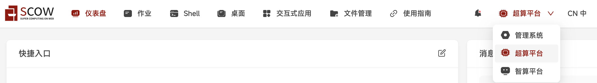

1.1.2 点击 Shell > Ascend-CranSched > login01 ，连接到集群的login节点，等待十几秒左右，能看到
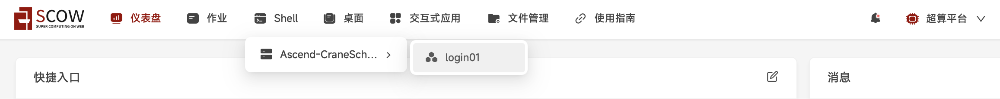

1.1.3 拷贝命令 pwd 粘贴到界面，并按 回车键，确保在正确的目录下：/data/home/你的用户名
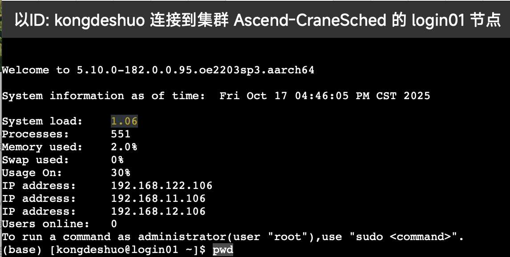

1.1.4 拷贝命令 mkdir model 粘贴到界面，并按 回车键，这样就在当前目录下新创建了一个名为 model 的目录，下载的模型都可以统一放在这个目录下面

1.1.4 拷贝命令 cd model 粘贴到界面，并按 回车键，这样就进入到刚新创建的名为 model 的目录里


1.1.5 拷贝命令 pip install modelscope 粘贴到界面，并按 回车键。
这里是安装了modelscope工具，次工具由模型下载的镜像网站提供

1.1.6 拷贝命令 modelscope download --model Qwen/Qwen3-4B-Instruct-2507 --local_dir ./Qwen/Qwen/Qwen3-4B-Instruct-2507 粘贴到界面，并按 回车键。
这里是通过刚安装的modelscope这个工具去镜像网站下载模型 Qwen3-4B-Instruct-2507

```bash
pip install modelscope
modelscope download --model Qwen/Qwen3-4B-Instruct-2507 --local_dir ./Qwen/Qwen/Qwen3-4B-Instruct-2507
```

## 2、使用使用SCOW AI集群管理模型
2.1 选取智算平台，进入AI集群

2.2 点击 模型 > 我的模型，进入提交作业页面
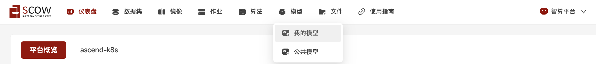

2.3 点击添加模型
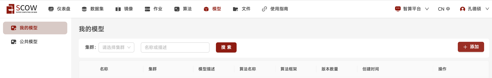

名称 QWen；集群 下拉菜单 ascend-k8s。
因为刚下载模型的是 Qwen3-4B-Instruct-2507，这里取的名称为QWen。可以根据下载的模型的名称进行命名。
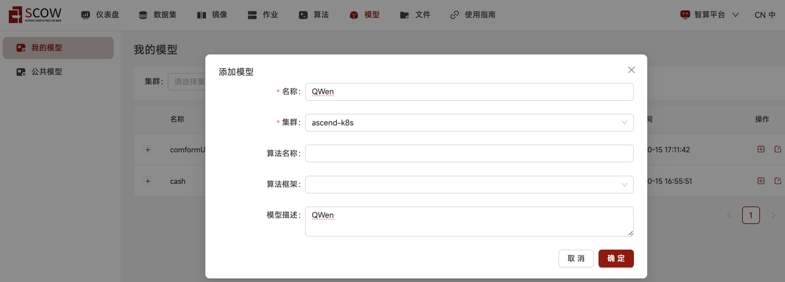


2.4 给模型添加版本
点击 + 号，给刚下载的模型创建版本号
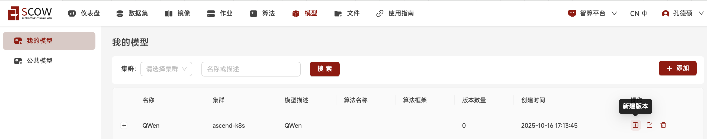

因为刚下载模型的是 Qwen3-4B-Instruct-2507，这里的版本名称取为 Qwen3-4B，在选择模型这里点击右边的图标
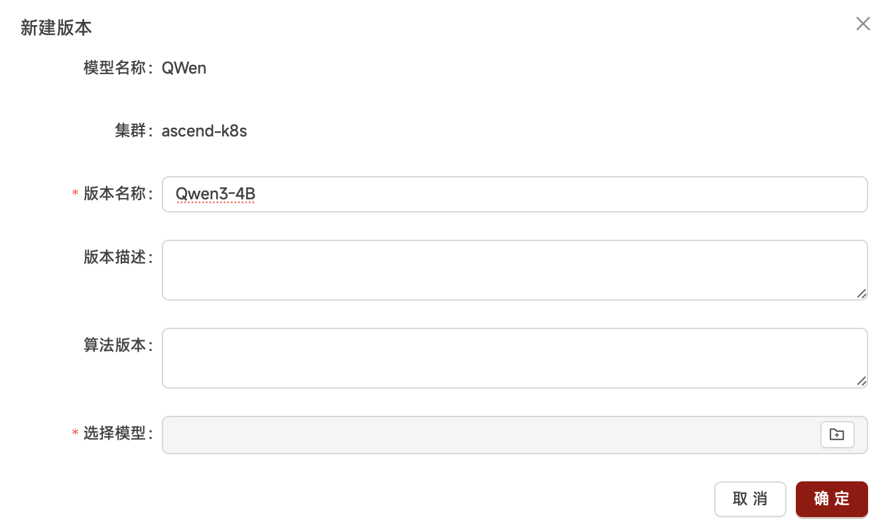

进入文件选择页面，在左侧找到刚创建的 model 目录，点击打开 QWen，在右边文件名中找到并选中 Qwen3-4B-Instruct-2507，点击右下角的 确认
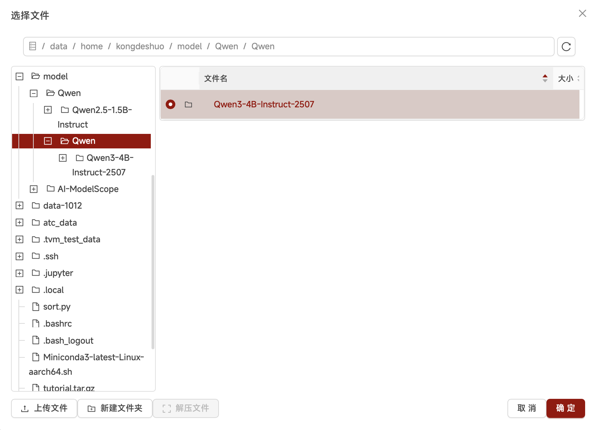

回到新建版本页面，此时可以看到 选择模型 中已经选好 Qwen3-4B-Instruct-2507模型，点击右下角的 确认
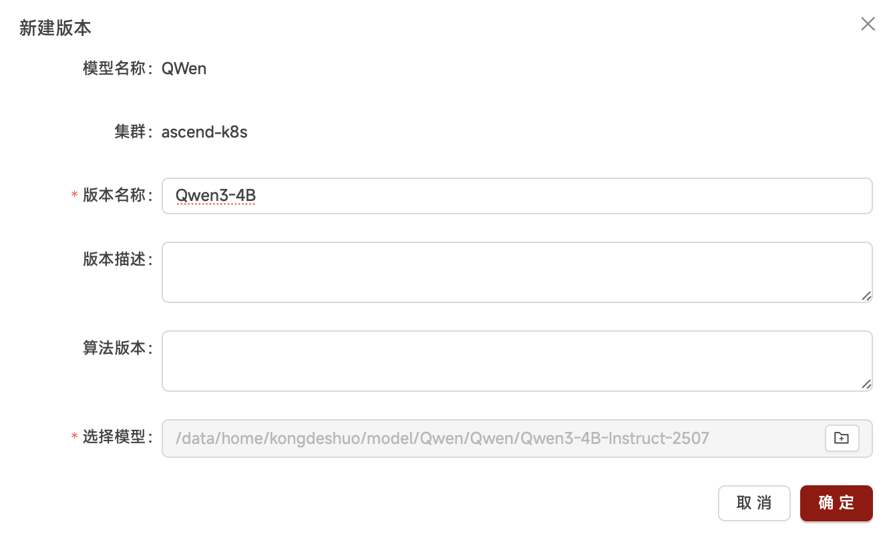

回到我的模型页面，点击 QWen 前面的 +号，可以看到模型的新版本 Qwen3-4B 已经创建成功
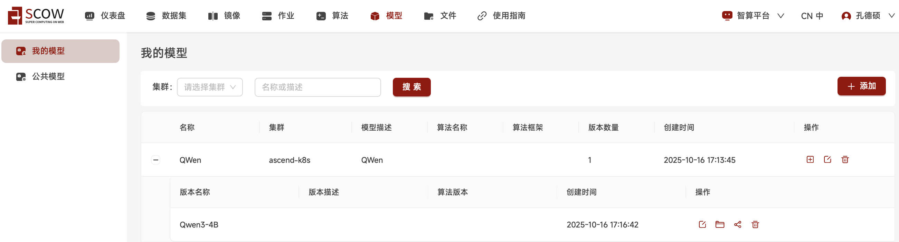

## 3、使用大模型进行推理

3.1 创建VSCode交互式应用
3.1.1 点击 作业 > ascend-k8s > 应用 > 创建应用
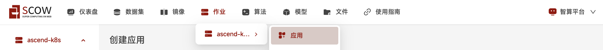

3.1.2 点击VSCode
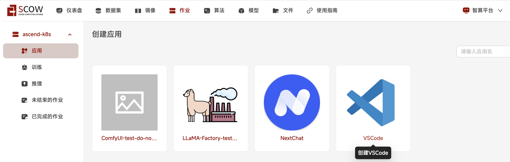

在创建VSCode交互应用页面中，进行配置：

3.1.3 拉取镜像
选择镜像源 - 远程镜像
运行命令 - 勾选 修改默认命令
* 将 app-store-images.pku.edu.cn/ascend/cann:8.1.rc1-910b-openeuler22.03-py3.10 拷贝后，粘贴到 远程镜像地址框中，用于平台根据镜像地址拉取相应的镜像
* 将 ${SCOW_AI_ALGORITHM_PATH}/bin/code-server 拷贝后，粘贴到 修改默认命令框中，用于平台启动VSCode应用
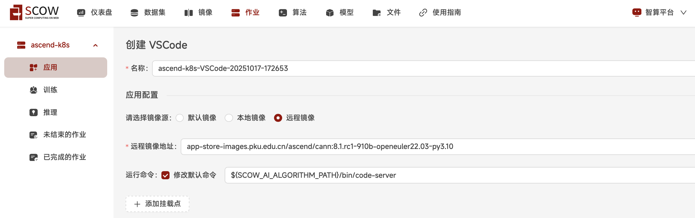

3.1.4 添加模型、算法
* 勾选添加类型 - 算法，下拉菜单中，选取 公共算法；算法下拉菜单中，选取 code-server(official) 算法，版本下拉菜单中，选取 4.95.3，此时应可以看到算法描述部分显示启动命令，与3.1.3步骤中的启动命令是一致的

* 勾选添加类型 - 模型，下拉菜单中，选取 我的模型；模型下拉菜单中，选取 Qwen(你的用户名) 模型，版本下拉菜单中，选取 Qwen3-4B

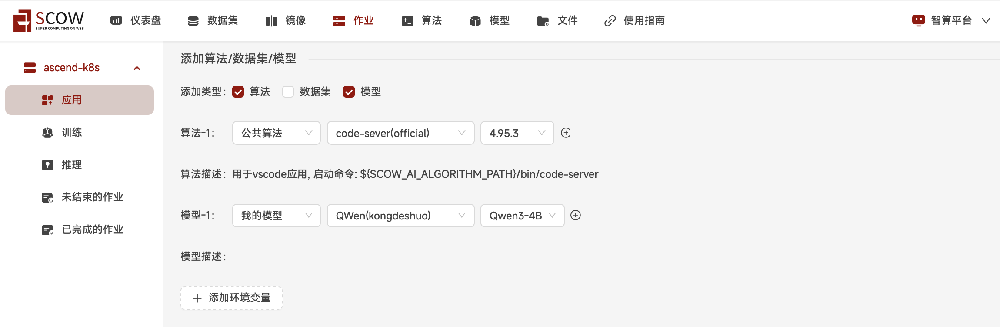

3.1.5 资源部分不需要修改，也可以根据实际需要在 单节点加速卡卡数 中修改为2/4/8（单节点上限是8卡，卡数越多，对大模型训练的时间会相应缩短）然后点击 提交 按钮
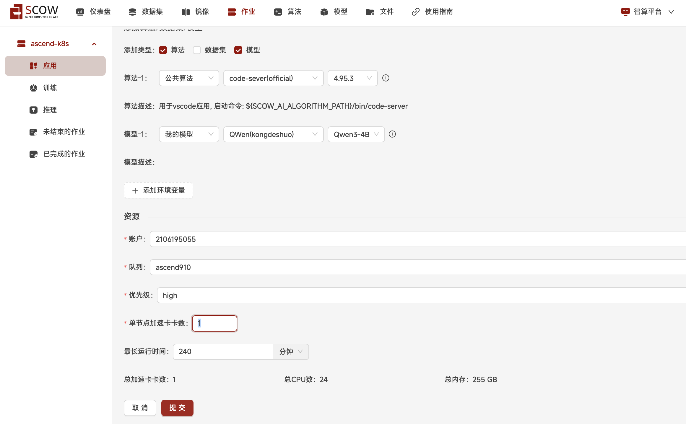

3.1.6 进入新创建的VScode应用的浏览器界面
提交后，刚创建的作业在 未结束的作业 列表中，作业状态为 PENDING。
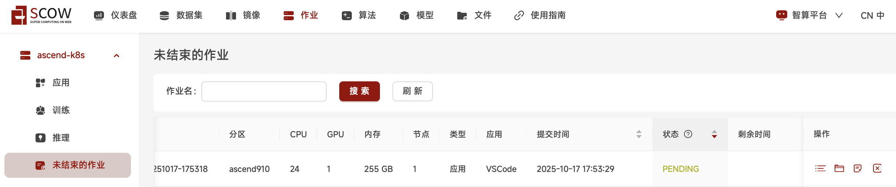

点击 刷新 按钮，手动进行刷新后，作业状态转为 RUNNING。

在这条作业的操作中，点击 进入 图标，浏览器将打开新的页面来展示新创建的VScode应用。
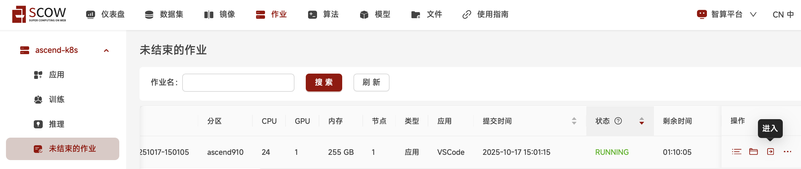

3.1.7 打开以自己用户名为名字的文件夹，之后的所有文件都将保存在这个文件夹下，之后的所有操作都将在这个文件夹下进行
点选左侧导航栏中第二个选项，显示 打开文件夹 按钮

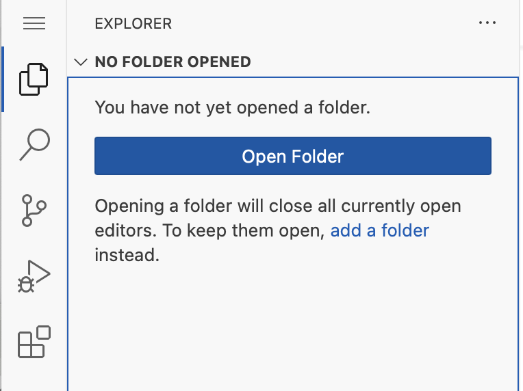

点击 打开文件夹 按钮，可见 最初的文件夹是 /root/
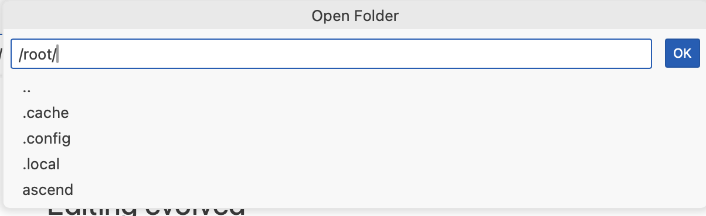

将输入框内的文件夹修改为 /data/home/你的用户名，点击 OK 按钮

点选左侧导航栏中第一个选项，选择 Termianl > New Terminal 创建新终端

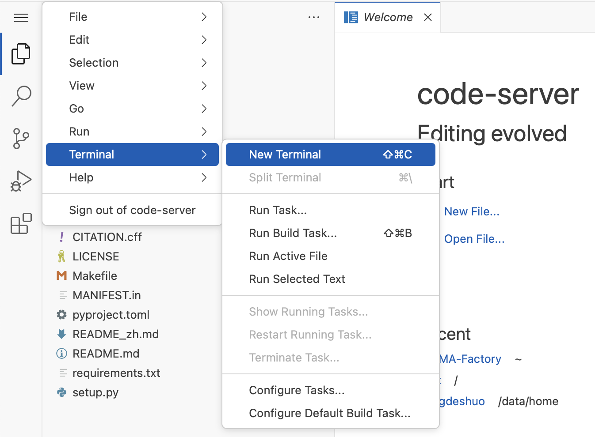

完整的VSCode应用包含的左侧文件夹、右侧上半区域的文件显示窗口、和右侧下半区域的终端

3.2 下载大模型推理所需要的工具
3.2.1 
* transformers 在右侧下半部的终端terminal中，粘贴命令 
```bash
pip install transformers==4.57.1 
```
再按回车键，确保成功安装


3.2.2
* accelerate 在右侧下半部的终端terminal中，粘贴命令 
```bash
pip install accelerate==1.10.1 
```
再按回车键，确保成功安装

3.2.2
* torch-npu 在右侧下半部的终端terminal中，粘贴命令 
```bash
pip3 install torch-npu==2.6.0
```
再按回车键，确保成功安装

3.2.3
* torchvision 在右侧下半部的终端terminal中，粘贴命令 
```bash
pip3 install torchvision==0.21.0 
```
再按回车键，确保成功安装

3.3 在用户名文件夹中创建 tutorial4.py 文件，这是作为大模型推理的文件
3.3.1 点击红色箭头所指的图标，新建文件，在蓝色方框内给新建的文件取名 tutorial4.py.py 再按回车键
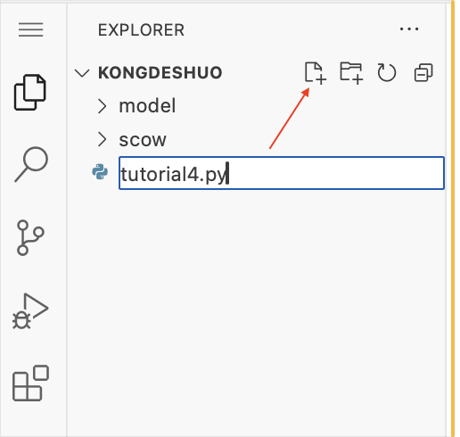

3.3.2 右侧上半部的窗口打开了这个新建的 tutorial4.py 空白文件
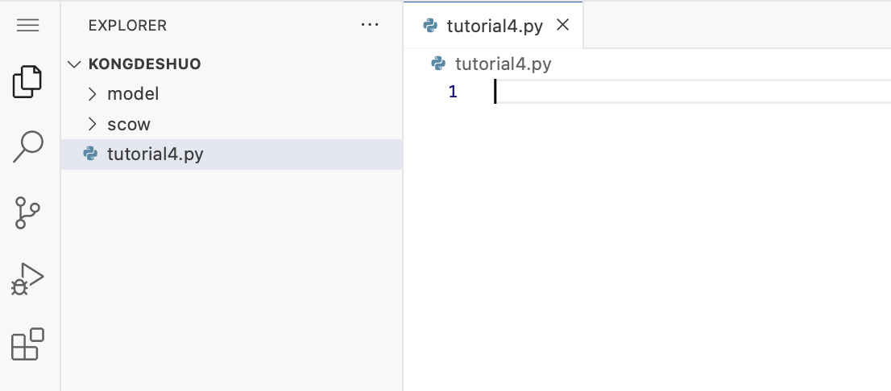

3.3.3 拷贝下面代码:
```python
from transformers import AutoModelForCausalLM, AutoTokenizer
import os
import torch
import torch_npu

# 模型路径
model_name = os.environ.get('SCOW_AI_MODEL_PATH')

# 硬件
device = torch.device('npu:0') if torch.npu.is_available() \
    else torch.device('cpu')

# 分词器和模型
tokenizer = AutoTokenizer.from_pretrained(model_name)
model = AutoModelForCausalLM.from_pretrained(
    model_name,
    dtype=torch.float16,
    device_map="auto"
).to(device)

# prepare the model input
prompt = "简短介绍什么是大模型"
messages = [
    {"role": "user", "content": prompt}
]
text = tokenizer.apply_chat_template(
    messages,
    tokenize=False,
    add_generation_prompt=True,
)
model_inputs = tokenizer([text], return_tensors="pt").to(model.device)

# conduct text completion
generated_ids = model.generate(
    **model_inputs,
    max_new_tokens=16384
)
output_ids = generated_ids[0][len(model_inputs.input_ids[0]):].tolist() 

content = tokenizer.decode(output_ids, skip_special_tokens=True)

print("content:", content)
```
3.3.4 粘贴到已经打开的空白的 tutorial4.py 文件，这样就完成了文件创建
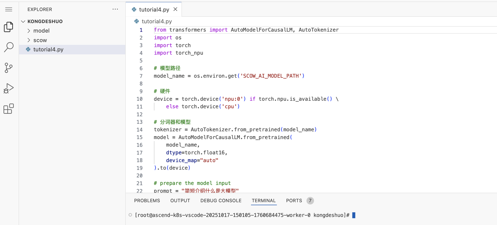

3.4 使用大模型进行推理
3.4.1 在右侧下半部的终端terminal中，粘贴命令 python tutorial4.py 再按回车键
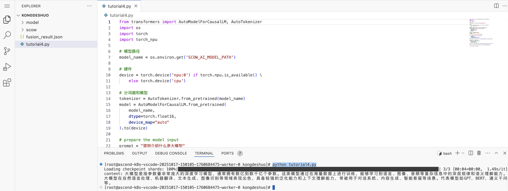

3.4.2 提示词在 tutorial4.py 中，任务是要大模型：简短介绍什么是大模型。大模型推理的内容如下图所示，完成了推理任务。
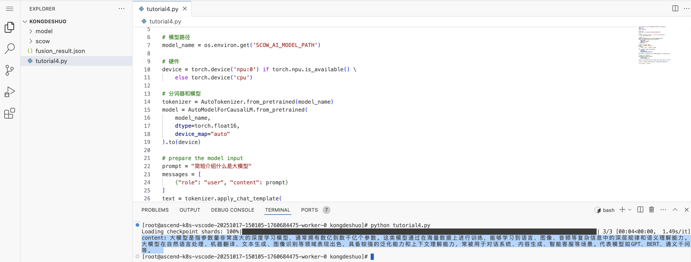