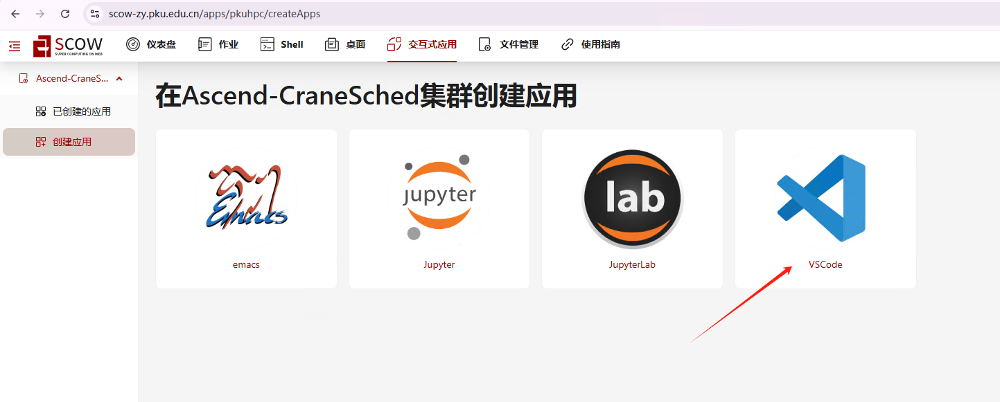
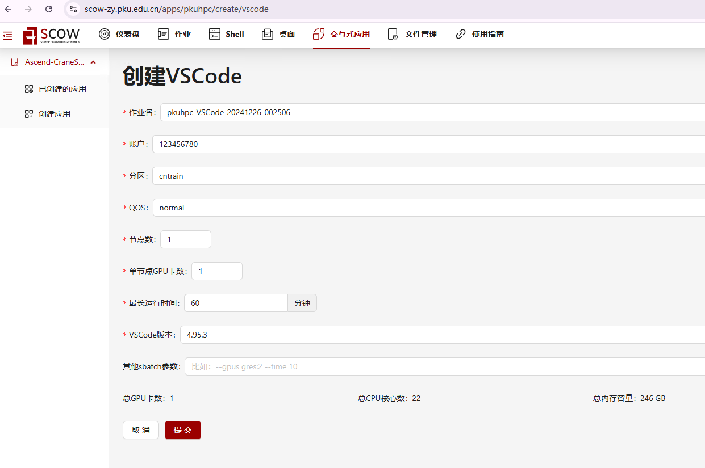
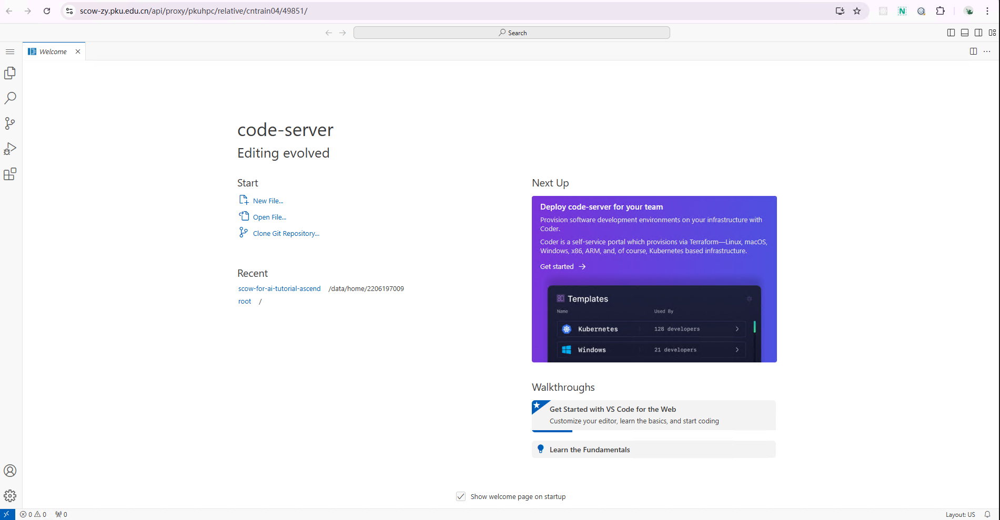

# Tutorial5: 通过在 SCOW 平台上上传模型、数据、镜像模型，展示模型微调

* 集群类型：SCOW HPC集群 SCOW AI集群
* 所需镜像：app-store-images.pku.edu.cn/ascendhub/ascend-code-server:code-server-4.20.0-1
* 所需模型：bert-base-uncased
* 所需数据集：教程内提供
* 所需硬件资源：建议使用1张910B NPU运行本教程。
* 目标：本节旨在使用 Hugging Face 官方发布的 bert-base-uncased 模型展示Bert模型微调的过程。

分以下几步来实现：
1. 环境安装
2. 加载模型和数据
3. 运行模型微调


## 1. 环境安装
### 1.1 登录
我们可以通过如下网址访问 (校外访问需通过北大vpn)：

集群入口: https://scow-zy.pku.edu.cn/

### 1.2 在SCOW HPC集群中安装环境

我们的教程使用 VSCode 运行，需要在 “交互式应用” 中创建应用。



在 VSCode 应用资源申请页面申请相应的资源，点击最下方的 “提交”，进行创建。



创建成功后，在“已创建的应用”中点击 “连接” 进入应用：


进入 VSCode 后界面如下：



### 1.3 安装conda
Conda 是一个开源的包管理和环境管理系统。它用于安装和管理软件包及其依赖项，同时允许用户创建独立的环境，以便在一个系统上运行多个项目。在命令行终端中运行如下命令以安装 conda：
```
# 1. 获得最新的miniconda安装包；
wget https://repo.anaconda.com/miniconda/Miniconda3-latest-Linux-aarch64.sh

# 2. 安装
chmod +x Miniconda3-latest-Linux-aarch64.sh
./Miniconda3-latest-Linux-aarch64.sh

# 3. 安装成功后可以删除安装包，节省存储空间
rm -f Miniconda3-latest-Linux-aarch64.sh

# 4. 执行以下命令，即可导入 conda 环境
source ~/.bashrc

# 5. 检查是否安装成功
conda --version

# 6. 初始化
conda init bash

# 7. 退出命令行再重新连接, 让conda生效
```

### 1.4 安装依赖、注册ipykernel
```
# 在Shell命令行中执行：

conda create -n tutorial python=3.9
conda activate tutorial

# 添加昇腾相关的环境变量
mkdir -p ${CONDA_PREFIX}/etc/conda/activate.d/
echo '#!/bin/bash
source /usr/local/Ascend/ascend-toolkit/set_env.sh
source /usr/local/Ascend/nnal/atb/set_env.sh' > ${CONDA_PREFIX}/etc/conda/activate.d/npu_load_env.sh
chmod +x ${CONDA_PREFIX}/etc/conda/activate.d/npu_load_env.sh
conda deactivate tutorial
conda activate tutorial

# 安装内核
conda install -y ipykernel
# 注册内核
python -m ipykernel install --user --name=tutorial --display-name="tutorial"

# 查看已注册的内核
jupyter kernelspec list

# 安装依赖
pip install torch==2.3.1 torch-npu==2.3.1 numpy==1.26.4 matplotlib==3.8.4 pandas==2.2.2 \
scikit-learn==1.5.0 pyyaml==6.0.2 torchvision==0.18.1 torchaudio==2.3.1 accelerate==1.2.1 \
scipy==1.13.1 attrs==24.3.0 deepspeed==0.16.2 transformers==4.42.4 datasets==3.2.0 \
evaluate==0.4.3 diffusers==0.32.1 sentencepiece==0.2.0 protobuf==5.29.2 \
-i https://mirrors.pku.edu.cn/pypi/web/simple

pip install  huggingface_hub==0.35.3 
# 平台已预置了驱动固件和CANN算子库，用户无需安装。
```

## 2. 下载模型和数据
```
# 通过命令行下载模型和数据
export HF_ENDPOINT=https://hf-mirror.com
python -c "from datasets import load_dataset; raw_datasets = load_dataset('glue', 'mrpc')"
huggingface-cli download --resume-download bert-base-uncased --local-dir ./bert-base-uncased
```

## 3. 运行模型微调
```
python run.py
```