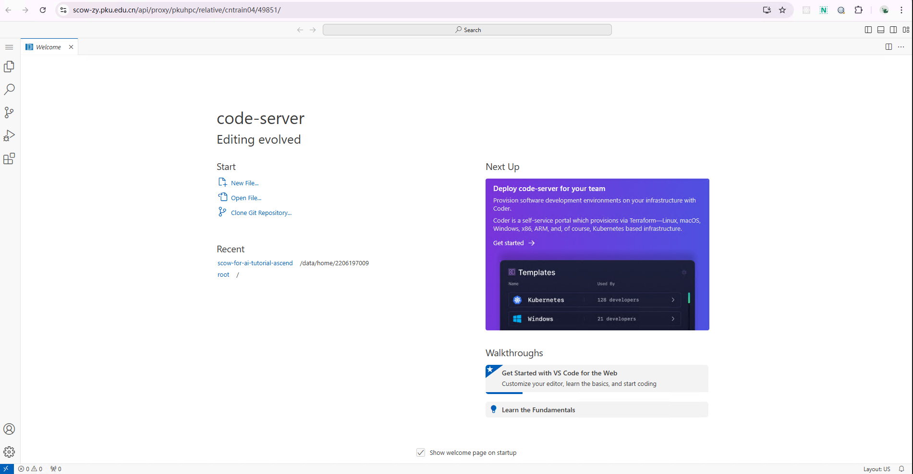
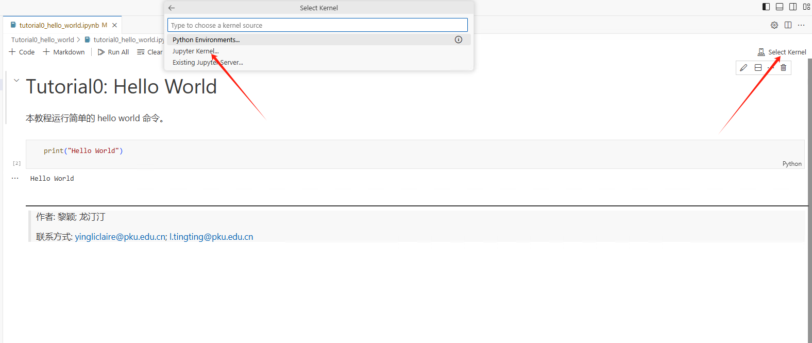
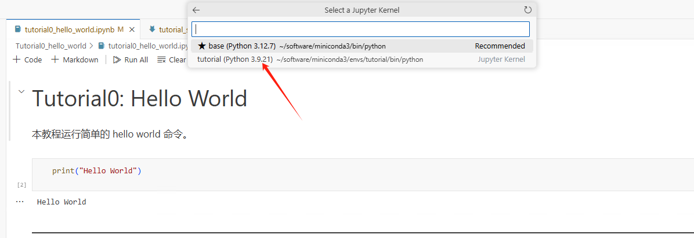

# Tutorial SCOW
本教程介绍如何在 SCOW 平台上申请计算资源并运行各类计算任务。 本教程在SCOW HPC集群中完成。在SCOW AI集群中操作过程类似。

## SCOW 平台申请计算资源

**1. 登陆**

我们可以通过如下网址访问 (校外访问需通过北大vpn)：

集群入口: https://scow-zy.pku.edu.cn/

**2. 创建交互式应用** 

我们的教程使用 VSCode 运行，需要在 “交互式应用” 中创建应用。


在 VSCode 应用资源申请页面申请相应的资源，点击最下方的 “提交”，进行创建。


创建成功后，在“已创建的应用”中点击 “连接” 进入应用：


进入 VSCode 后界面如下：


## 安装 conda

Conda 是一个开源的包管理和环境管理系统。它用于安装和管理软件包及其依赖项，同时允许用户创建独立的环境，以便在一个系统上运行多个项目。在命令行终端中运行如下命令以安装 conda：

```bash
# 0. 安装 wget
sudo apt update
sudo apt install wget

# 1. 获得最新的miniconda安装包；
wget https://repo.anaconda.com/miniconda/Miniconda3-latest-Linux-aarch64.sh

# 2. 安装
chmod +x Miniconda3-latest-Linux-aarch64.sh
./Miniconda3-latest-Linux-aarch64.sh

# 3. 安装成功后可以删除安装包，节省存储空间
rm -f Miniconda3-latest-Linux-aarch64.sh

# 4. 执行以下命令，即可导入 conda 环境
source ~/.bashrc

# 5. 检查是否安装成功
conda --version

# 6. 初始化
conda init bash

# 7. 退出命令行再重新连接, 让conda生效
```

## 安装依赖、注册ipykernel

在Shell命令行中执行：

```bash
conda create -n tutorial python=3.9
conda activate tutorial

# 添加昇腾相关的环境变量
mkdir -p ${CONDA_PREFIX}/etc/conda/activate.d/
echo '#!/bin/bash
source /usr/local/Ascend/ascend-toolkit/set_env.sh
source /usr/local/Ascend/nnal/atb/set_env.sh' > ${CONDA_PREFIX}/etc/conda/activate.d/npu_load_env.sh
chmod +x ${CONDA_PREFIX}/etc/conda/activate.d/npu_load_env.sh
conda deactivate tutorial
conda activate tutorial

# 安装内核
conda install -y ipykernel
# 注册内核
python -m ipykernel install --user --name=tutorial --display-name="tutorial"

# 查看已注册的内核
jupyter kernelspec list

# 安装依赖
pip install torch==2.3.1 torch-npu==2.3.1 numpy==1.26.4 matplotlib==3.8.4 pandas==2.2.2 scikit-learn==1.5.0 pyyaml==6.0.2 torchvision==0.18.1 torchaudio==2.3.1 accelerate==1.2.1 scipy==1.13.1 attrs==24.3.0 deepspeed==0.16.2 transformers==4.33.2 datasets==3.2.0 evaluate==0.4.3 diffusers==0.32.1 sentencepiece==0.2.0 protobuf==5.29.2 -i https://mirrors.pku.edu.cn/pypi/web/simple
```
平台已预置了驱动固件和CANN算子库，用户无需安装。

## 运行 Tutorial 0

**1. 获取教程所需文件**

在命令行终端中执行：

```bash
wget https://scow-zy.pku.edu.cn/tutorial/tutorial.tar.gz
tar -xzf tutorial.tar.gz
```

**2. 运行 Tutorial 0**

在所下载的教程文件夹中打开 tutorial/Tutorial0_hello_world/tutorial0_hello_world.ipynb 文件。可以看到文件中有 markdown 单元格和 python 代码单元格。首先选择  kernel 为 tutorial，然后用鼠标点击选中单元格后，“Ctrl + Enter” 可运行单元格，markdown 在运行后起到渲染的效果，python 会在下方输出结果。注意：苹果电脑使用的快捷键会有所不同。




## 教程内容

教程目前由 7 个独立的案例构成：

### Pytorch 基础
  - **[Tutorial1](Tutorial1_regression/tutorial1_regression.ipynb)**: 通过预测房价这一简单案例展示如何使用全连接神经网络解决回归问题，并在单机单显卡上运行案例。

### CV 相关
  - **[Tutorial2](Tutorial2_classification/tutorial2_classification.ipynb)**: 通过MNIST数据集和一个规模较小的简单CNN网络展示使用CNN进行图像分类的简单案例。
  - **[Tutorial3](Tutorial3_CV/tutorial3_CV.ipynb)**: 这部分旨在展示更接近实际的训练场景，使用ResNet18训练CIFAR-10数据集，并使用一系列函数测试训练过程的性能。

### 大模型相关
  - **[Tutorial4](Tutorial4_大模型推理/tutorial4_大模型推理.ipynb)**: 通过在 SCOW 平台上运行 cpm-bee-2b 模型，展示模型推理任务。
  - **[Tutorial5](Tutorial5_Bert模型微调/tutorial5_Bert模型微调.ipynb)**: 通过在 SCOW 平台上上传模型、数据、镜像模型，展示模型微调。
  - **[Tutorial6](Tutorial6_stable-diffusion-3-medium/tutorial6_stable_diffusion.ipynb)**: stable-diffusion-3-medium 文生图任务，通过 prompt 提示生成对应的图片。
  
### 使用自定义镜像和模型

  - **[Tutorial7](Tutorial7_使用自定义镜像和模型/tutorial7_使用自定义镜像和模型.ipynb)**: 上传自定义的镜像、模型、数据，使用 AI 训练模块进行训练。
  
---

> 作者: 黎颖; 龙汀汀
>
> 联系方式: yingliclaire@pku.edu.cn;   l.tingting@pku.edu.cn
> 
> 测试由 褚苙扬（cly2412307718@stu.pku.edu.cn）同学完成
